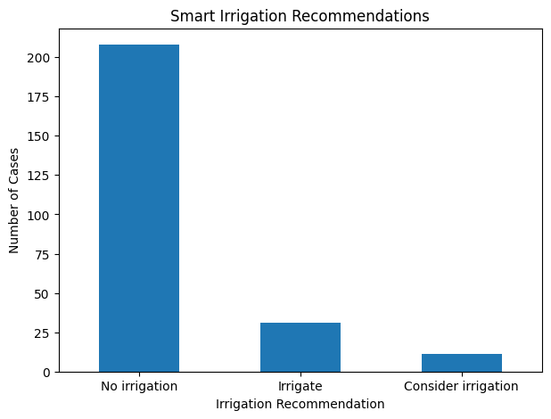

# Smart Irrigation Decision System

**Type:** Self-directed student prototype  
**Dataset:** Synthetic sensor/weather-style data.

## Objective
Build a simple decision-support prototype that combines soil moisture and rainfall forecast to produce an irrigation recommendation.

## Tools
Python, Pandas

## Logic
- Low soil moisture + little forecast rain → Irrigate
- Moderate soil moisture + very little forecast rain → Consider irrigation
- Otherwise → No irrigation

## Important
This is an educational rule-based prototype, not an agronomic prescription. Real deployment would require crop-specific evapotranspiration, soil properties, weather forecasts, irrigation-system constraints and field validation.
## Model Visualization

The chart below shows the distribution of irrigation recommendations generated by the decision system based on soil moisture and rainfall conditions.

